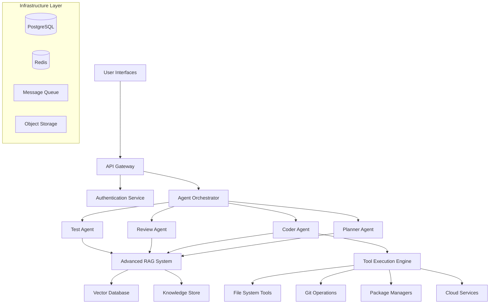

# Technical Specifications

## Document Overview

**Version**: 1.0  
**Last Updated**: 2024-08-31  
**Scope**: Complete technical specifications for Turbo Local Coder Agent evolution

## Table of Contents

1. [System Architecture](#system-architecture)
2. [API Contracts & Interfaces](#api-contracts--interfaces)
3. [Data Models](#data-models)
4. [Tool Ecosystem Specifications](#tool-ecosystem-specifications)
5. [Agent Architecture](#agent-architecture)
6. [RAG System Architecture](#rag-system-architecture)
7. [Security Specifications](#security-specifications)
8. [Performance Requirements](#performance-requirements)
9. [Integration Specifications](#integration-specifications)
10. [Deployment Architecture](#deployment-architecture)

---

## System Architecture

### Core System Design Principles

```python
"""
System Architecture Principles:
1. Modularity: Loosely coupled components with well-defined interfaces
2. Scalability: Horizontal scaling capability with stateless design
3. Reliability: Fault tolerance with graceful degradation
4. Security: Defense-in-depth with zero-trust architecture
5. Observability: Comprehensive logging, metrics, and tracing
6. Extensibility: Plugin architecture for tools and agents
"""
```

### High-Level Architecture



### Component Interaction Flow

```python
@dataclass
class SystemFlow:
    """
    Defines the complete system interaction flow for request processing.
    
    Flow Stages:
    1. Request Authentication & Authorization
    2. Request Routing & Load Balancing
    3. Agent Selection & Task Decomposition
    4. Knowledge Retrieval & Context Building
    5. Tool Execution & Result Aggregation
    6. Response Formatting & Delivery
    """
    
    async def process_request(self, request: DevelopmentRequest) -> DevelopmentResponse:
        """
        Complete request processing pipeline with error handling and monitoring.
        
        Args:
            request: User development request with context
            
        Returns:
            Complete development response with results and metadata
            
        Raises:
            AuthenticationError: Invalid user credentials
            AuthorizationError: Insufficient permissions
            ValidationError: Invalid request format
            ProcessingError: Internal processing failure
        """
        # Stage 1: Authentication & Authorization
        user = await self.auth_service.authenticate(request.credentials)
        await self.auth_service.authorize(user, request.required_permissions)
        
        # Stage 2: Request Validation & Routing
        validated_request = await self.validator.validate(request)
        agent_plan = await self.orchestrator.plan_execution(validated_request)
        
        # Stage 3: Knowledge Retrieval
        context = await self.rag_system.build_context(validated_request)
        
        # Stage 4: Agent Execution
        results = await self.orchestrator.execute_plan(agent_plan, context)
        
        # Stage 5: Response Assembly
        response = await self.response_builder.build_response(results)
        
        # Stage 6: Audit & Monitoring
        await self.audit_service.log_operation(user, request, response)
        
        return response
```

---

## API Contracts & Interfaces

### RESTful API Specification

```python
class DevelopmentAPI:
    """
    Complete API specification for development operations.
    
    Base URL: https://api.turbo-coder.dev/v1
    Authentication: Bearer token (JWT)
    Rate Limiting: 1000 requests/hour per user
    """

    # ============================================================================
    # Project Management APIs
    # ============================================================================
    
    async def create_project(self, request: CreateProjectRequest) -> CreateProjectResponse:
        """
        POST /projects
        
        Create a new development project with initial analysis.
        
        Request Body:
        {
            "name": "my-awesome-app",
            "description": "Web application for task management",
            "project_type": "web_application",
            "technologies": ["python", "fastapi", "postgresql"],
            "repository_url": "https://github.com/user/repo",
            "configuration": {
                "python_version": "3.11",
                "framework": "fastapi",
                "database": "postgresql"
            }
        }
        
        Response:
        {
            "project_id": "proj_abc123",
            "status": "created",
            "analysis": {
                "detected_languages": ["python"],
                "recommended_tools": ["poetry", "pytest", "black"],
                "estimated_complexity": "medium",
                "setup_time_estimate": "15 minutes"
            },
            "next_steps": [
                "Initialize repository structure",
                "Set up development environment",
                "Configure CI/CD pipeline"
            ]
        }
        
        Error Responses:
        - 400: Invalid project configuration
        - 401: Authentication required
        - 403: Insufficient permissions
        - 409: Project name already exists
        - 422: Validation errors in request data
        """
    
    async def get_project(self, project_id: str) -> GetProjectResponse:
        """
        GET /projects/{project_id}
        
        Retrieve complete project information and current status.
        """
    
    async def update_project(self, project_id: str, request: UpdateProjectRequest) -> UpdateProjectResponse:
        """
        PATCH /projects/{project_id}
        
        Update project configuration and settings.
        """
    
    async def delete_project(self, project_id: str) -> DeleteProjectResponse:
        """
        DELETE /projects/{project_id}
        
        Soft delete project with option to recover within 30 days.
        """
    
    # ============================================================================
    # Development Task APIs
    # ============================================================================
    
    async def create_task(self, project_id: str, request: CreateTaskRequest) -> CreateTaskResponse:
        """
        POST /projects/{project_id}/tasks
        
        Create a new development task with AI-powered planning.
        
        Request Body:
        {
            "description": "Add user authentication with JWT tokens",
            "requirements": [
                "User registration and login endpoints",
                "JWT token generation and validation",
                "Password hashing with bcrypt",
                "User session management"
            ],
            "constraints": {
                "deadline": "2024-09-15T00:00:00Z",
                "max_complexity": "high",
                "testing_required": true,
                "security_review": true
            },
            "context": {
                "related_files": ["/app/models/user.py", "/app/auth/"],
                "dependencies": ["fastapi", "jwt", "bcrypt"],
                "environment": "development"
            }
        }
        
        Response:
        {
            "task_id": "task_xyz789",
            "status": "planned",
            "execution_plan": {
                "phases": [
                    {
                        "name": "Planning",
                        "agent": "ArchitectAgent",
                        "estimated_duration": "10 minutes",
                        "deliverables": ["Architecture design", "API specification"]
                    },
                    {
                        "name": "Implementation",
                        "agent": "CoderAgent", 
                        "estimated_duration": "45 minutes",
                        "deliverables": ["Authentication endpoints", "JWT utilities", "User model updates"]
                    },
                    {
                        "name": "Testing",
                        "agent": "TestAgent",
                        "estimated_duration": "20 minutes", 
                        "deliverables": ["Unit tests", "Integration tests", "Security tests"]
                    },
                    {
                        "name": "Review",
                        "agent": "ReviewAgent",
                        "estimated_duration": "15 minutes",
                        "deliverables": ["Code review", "Security audit", "Documentation review"]
                    }
                ],
                "total_estimated_duration": "90 minutes",
                "confidence_score": 0.92,
                "risk_factors": [
                    "Complex authentication flow requires careful testing",
                    "Security implementation needs expert review"
                ]
            },
            "resource_requirements": {
                "cpu_cores": 2,
                "memory_gb": 4,
                "storage_gb": 1,
                "network_bandwidth": "10 Mbps"
            }
        }
        """
    
    async def execute_task(self, task_id: str, request: ExecuteTaskRequest) -> ExecuteTaskResponse:
        """
        POST /tasks/{task_id}/execute
        
        Execute a planned development task with real-time monitoring.
        """
    
    async def get_task_status(self, task_id: str) -> GetTaskStatusResponse:
        """
        GET /tasks/{task_id}
        
        Get current task execution status and progress.
        """
    
    # ============================================================================
    # Real-time Development APIs
    # ============================================================================
    
    async def start_development_session(self, project_id: str, request: StartSessionRequest) -> StartSessionResponse:
        """
        POST /projects/{project_id}/sessions
        
        Start an interactive development session with WebSocket connection.
        """
    
    async def websocket_connection(self, session_id: str) -> WebSocketConnection:
        """
        WebSocket: /sessions/{session_id}/ws
        
        Real-time bidirectional communication for development operations.
        
        Message Types:
        - code_change: Real-time code modifications
        - execution_request: Run code or tools
        - ai_assistance: Request AI help
        - collaboration_event: Multi-user collaboration
        """

    # ============================================================================
    # Knowledge Management APIs  
    # ============================================================================
    
    async def search_knowledge(self, request: SearchKnowledgeRequest) -> SearchKnowledgeResponse:
        """
        POST /knowledge/search
        
        Semantic search across the knowledge base.
        """
    
    async def add_knowledge(self, request: AddKnowledgeRequest) -> AddKnowledgeResponse:
        """
        POST /knowledge
        
        Add custom knowledge to the system.
        """
```

### WebSocket API Specification

```python
class WebSocketAPI:
    """
    Real-time WebSocket API for interactive development sessions.
    
    Connection URL: wss://api.turbo-coder.dev/v1/sessions/{session_id}/ws
    Protocol: JSON messages with message_type field
    Authentication: JWT token in connection headers
    """
    
    # Incoming message types (client -> server)
    CLIENT_MESSAGES = {
        "code_edit": {
            "message_type": "code_edit",
            "file_path": str,
            "changes": List[TextChange],
            "cursor_position": CursorPosition
        },
        "execute_code": {
            "message_type": "execute_code", 
            "code": str,
            "language": str,
            "context": ExecutionContext
        },
        "ai_request": {
            "message_type": "ai_request",
            "query": str,
            "context": DevelopmentContext,
            "preferred_agent": str
        },
        "tool_execution": {
            "message_type": "tool_execution",
            "tool_name": str,
            "parameters": Dict[str, Any],
            "async_execution": bool
        }
    }
    
    # Outgoing message types (server -> client)
    SERVER_MESSAGES = {
        "code_suggestion": {
            "message_type": "code_suggestion",
            "suggestions": List[CodeSuggestion],
            "confidence": float,
            "reasoning": str
        },
        "execution_result": {
            "message_type": "execution_result",
            "success": bool,
            "output": str,
            "errors": List[ExecutionError],
            "execution_time": float
        },
        "ai_response": {
            "message_type": "ai_response",
            "response": str,
            "agent": str,
            "context_used": List[KnowledgeChunk],
            "follow_up_actions": List[Action]
        },
        "system_notification": {
            "message_type": "system_notification",
            "level": str,  # info, warning, error
            "title": str,
            "message": str,
            "actions": List[NotificationAction]
        }
    }
```

---

## Data Models

### Core Domain Models

```python
from typing import Optional, List, Dict, Any, Union
from datetime import datetime, timedelta
from enum import Enum
from uuid import UUID
from pydantic import BaseModel, Field, validator
from dataclasses import dataclass

# ============================================================================
# Project Domain Models
# ============================================================================

class ProjectType(str, Enum):
    """Supported project types with specific handling."""
    WEB_APPLICATION = "web_application"
    API_SERVICE = "api_service"
    MOBILE_APP = "mobile_app"
    DESKTOP_APP = "desktop_app"
    DATA_SCIENCE = "data_science"
    MACHINE_LEARNING = "machine_learning"
    BLOCKCHAIN = "blockchain"
    GAME_DEVELOPMENT = "game_development"
    EMBEDDED_SYSTEM = "embedded_system"
    DEVOPS_INFRASTRUCTURE = "devops_infrastructure"

class Language(str, Enum):
    """Supported programming languages."""
    PYTHON = "python"
    JAVASCRIPT = "javascript"
    TYPESCRIPT = "typescript"
    RUST = "rust"
    GO = "go"
    JAVA = "java"
    CSHARP = "csharp"
    CPP = "cpp"
    SWIFT = "swift"
    KOTLIN = "kotlin"

class Framework(str, Enum):
    """Popular frameworks by language ecosystem."""
    # Python
    FASTAPI = "fastapi"
    DJANGO = "django"
    FLASK = "flask"
    # JavaScript/TypeScript
    REACT = "react"
    VUE = "vue"
    ANGULAR = "angular"
    NODEJS = "nodejs"
    EXPRESS = "express"
    NEXTJS = "nextjs"
    # Rust
    ACTIX_WEB = "actix-web"
    ROCKET = "rocket"
    # Go
    GIN = "gin"
    ECHO = "echo"
    # Java
    SPRING_BOOT = "spring-boot"
    QUARKUS = "quarkus"

class ProjectMetadata(BaseModel):
    """
    Complete project metadata with rich information for AI understanding.
    
    This model contains all information needed for intelligent project
    management, code generation, and architectural decisions.
    """
    
    # Core Identification
    id: UUID = Field(..., description="Unique project identifier")
    name: str = Field(..., min_length=1, max_length=100, description="Human-readable project name")
    slug: str = Field(..., regex=r'^[a-z0-9-]+$', description="URL-safe project identifier")
    description: Optional[str] = Field(None, max_length=1000, description="Project description")
    
    # Project Classification
    project_type: ProjectType = Field(..., description="Primary project type")
    languages: List[Language] = Field(..., min_items=1, description="Programming languages used")
    frameworks: List[Framework] = Field(default_factory=list, description="Frameworks and libraries")
    
    # Repository Information
    repository_url: Optional[str] = Field(None, description="Git repository URL")
    main_branch: str = Field(default="main", description="Primary development branch")
    
    # File System Structure
    root_path: str = Field(..., description="Absolute path to project root")
    source_directories: List[str] = Field(default_factory=list, description="Source code directories")
    test_directories: List[str] = Field(default_factory=list, description="Test code directories")
    config_files: List[str] = Field(default_factory=list, description="Configuration files")
    
    # Dependencies and Build
    dependency_files: List[str] = Field(default_factory=list, description="Dependency definition files")
    build_system: Optional[str] = Field(None, description="Build system (make, npm, cargo, etc.)")
    build_commands: List[str] = Field(default_factory=list, description="Build commands")
    test_commands: List[str] = Field(default_factory=list, description="Test execution commands")
    
    # Architecture and Patterns
    architecture_pattern: Optional[str] = Field(None, description="Primary architectural pattern")
    design_patterns: List[str] = Field(default_factory=list, description="Identified design patterns")
    
    # Quality Metrics
    total_lines: int = Field(default=0, description="Total lines of code")
    test_coverage: Optional[float] = Field(None, ge=0, le=100, description="Test coverage percentage")
    complexity_score: Optional[float] = Field(None, ge=0, description="Code complexity metric")
    technical_debt_hours: Optional[float] = Field(None, ge=0, description="Estimated technical debt")
    
    # Collaboration
    team_members: List[str] = Field(default_factory=list, description="Team member identifiers")
    coding_standards: Optional[str] = Field(None, description="Coding standards document")
    
    # AI Context
    ai_context: Dict[str, Any] = Field(default_factory=dict, description="AI-specific metadata")
    last_analyzed: Optional[datetime] = Field(None, description="Last AI analysis timestamp")
    
    # Timestamps
    created_at: datetime = Field(default_factory=datetime.utcnow)
    updated_at: datetime = Field(default_factory=datetime.utcnow)
    
    @validator('languages')
    def validate_language_compatibility(cls, v, values):
        """Ensure language combination makes sense."""
        if not v:
            raise ValueError("At least one language must be specified")
        return v
    
    class Config:
        json_encoders = {
            datetime: lambda v: v.isoformat(),
            UUID: str
        }

# ============================================================================
# Task and Execution Models
# ============================================================================

class TaskStatus(str, Enum):
    """Task execution lifecycle states."""
    CREATED = "created"
    PLANNED = "planned" 
    IN_PROGRESS = "in_progress"
    BLOCKED = "blocked"
    COMPLETED = "completed"
    FAILED = "failed"
    CANCELLED = "cancelled"

class TaskPriority(str, Enum):
    """Task priority levels."""
    LOW = "low"
    MEDIUM = "medium"
    HIGH = "high"
    URGENT = "urgent"

class DevelopmentTask(BaseModel):
    """
    Comprehensive development task with AI-powered planning and execution.
    
    Represents a single unit of development work that can be planned,
    executed, and monitored by the AI agent system.
    """
    
    # Core Task Information
    id: UUID = Field(..., description="Unique task identifier")
    project_id: UUID = Field(..., description="Associated project identifier")
    title: str = Field(..., min_length=1, max_length=200, description="Task title")
    description: str = Field(..., min_length=10, description="Detailed task description")
    
    # Task Classification
    task_type: str = Field(..., description="Type of development task")
    priority: TaskPriority = Field(default=TaskPriority.MEDIUM)
    complexity: str = Field(..., description="Estimated complexity (low/medium/high)")
    
    # Requirements and Constraints
    requirements: List[str] = Field(default_factory=list, description="Functional requirements")
    constraints: Dict[str, Any] = Field(default_factory=dict, description="Technical constraints")
    acceptance_criteria: List[str] = Field(default_factory=list, description="Definition of done")
    
    # Context Information
    related_files: List[str] = Field(default_factory=list, description="Files relevant to this task")
    dependencies: List[str] = Field(default_factory=list, description="Task dependencies")
    tags: List[str] = Field(default_factory=list, description="Categorization tags")
    
    # Execution Planning
    execution_plan: Optional['ExecutionPlan'] = Field(None, description="AI-generated execution plan")
    estimated_duration: Optional[timedelta] = Field(None, description="Estimated completion time")
    assigned_agents: List[str] = Field(default_factory=list, description="Assigned AI agents")
    
    # Progress Tracking
    status: TaskStatus = Field(default=TaskStatus.CREATED)
    progress_percentage: float = Field(default=0.0, ge=0, le=100, description="Completion percentage")
    current_phase: Optional[str] = Field(None, description="Current execution phase")
    
    # Results and Artifacts
    generated_files: List[str] = Field(default_factory=list, description="Files created by task")
    test_results: Optional['TestResults'] = Field(None, description="Test execution results")
    quality_metrics: Dict[str, Any] = Field(default_factory=dict, description="Quality measurements")
    
    # Collaboration and Review
    reviewer: Optional[str] = Field(None, description="Assigned reviewer")
    review_status: Optional[str] = Field(None, description="Review status")
    feedback: List[str] = Field(default_factory=list, description="Review feedback")
    
    # Timestamps
    created_at: datetime = Field(default_factory=datetime.utcnow)
    started_at: Optional[datetime] = Field(None)
    completed_at: Optional[datetime] = Field(None)
    deadline: Optional[datetime] = Field(None)

class ExecutionPlan(BaseModel):
    """
    AI-generated execution plan for development tasks.
    
    Contains detailed steps, resource requirements, and risk assessment
    for intelligent task execution.
    """
    
    # Plan Overview
    plan_id: UUID = Field(..., description="Unique plan identifier")
    task_id: UUID = Field(..., description="Associated task identifier")
    version: int = Field(default=1, description="Plan version number")
    
    # Execution Phases
    phases: List['ExecutionPhase'] = Field(..., min_items=1, description="Execution phases")
    total_estimated_duration: timedelta = Field(..., description="Total estimated time")
    confidence_score: float = Field(..., ge=0, le=1, description="Plan confidence (0-1)")
    
    # Resource Requirements
    resource_requirements: 'ResourceRequirements' = Field(..., description="Required resources")
    
    # Risk Assessment
    risk_factors: List[str] = Field(default_factory=list, description="Identified risks")
    mitigation_strategies: List[str] = Field(default_factory=list, description="Risk mitigations")
    
    # Knowledge Context
    required_knowledge: List[str] = Field(default_factory=list, description="Required knowledge areas")
    context_sources: List[str] = Field(default_factory=list, description="Knowledge sources used")
    
    # Plan Metadata
    generated_by: str = Field(..., description="Agent that generated this plan")
    generated_at: datetime = Field(default_factory=datetime.utcnow)
    last_updated: datetime = Field(default_factory=datetime.utcnow)

class ExecutionPhase(BaseModel):
    """Individual phase within an execution plan."""
    
    name: str = Field(..., description="Phase name")
    description: str = Field(..., description="Phase description")
    agent_type: str = Field(..., description="Required agent type")
    estimated_duration: timedelta = Field(..., description="Estimated phase duration")
    
    # Phase Dependencies
    depends_on: List[str] = Field(default_factory=list, description="Dependent phase names")
    blocking_for: List[str] = Field(default_factory=list, description="Phases blocked by this")
    
    # Deliverables
    deliverables: List[str] = Field(default_factory=list, description="Expected deliverables")
    success_criteria: List[str] = Field(default_factory=list, description="Success criteria")
    
    # Execution Details
    commands: List[str] = Field(default_factory=list, description="Commands to execute")
    files_to_create: List[str] = Field(default_factory=list, description="Files to be created")
    files_to_modify: List[str] = Field(default_factory=list, description="Files to be modified")

# ============================================================================
# Agent and Knowledge Models
# ============================================================================

class AgentCapability(str, Enum):
    """Available agent capabilities."""
    CODE_GENERATION = "code_generation"
    CODE_REVIEW = "code_review"
    TEST_GENERATION = "test_generation"
    ARCHITECTURE_DESIGN = "architecture_design"
    DATABASE_DESIGN = "database_design"
    DEVOPS_AUTOMATION = "devops_automation"
    SECURITY_ANALYSIS = "security_analysis"
    PERFORMANCE_OPTIMIZATION = "performance_optimization"
    DOCUMENTATION_GENERATION = "documentation_generation"
    PROJECT_PLANNING = "project_planning"

class AgentSpecialization(BaseModel):
    """Definition of agent specialization and capabilities."""
    
    agent_type: str = Field(..., description="Agent type identifier")
    name: str = Field(..., description="Human-readable agent name")
    description: str = Field(..., description="Agent description and purpose")
    
    capabilities: List[AgentCapability] = Field(..., description="Agent capabilities")
    supported_languages: List[Language] = Field(..., description="Supported programming languages")
    supported_frameworks: List[Framework] = Field(default_factory=list, description="Supported frameworks")
    
    # Performance Characteristics
    average_response_time: Optional[float] = Field(None, description="Average response time in seconds")
    success_rate: Optional[float] = Field(None, ge=0, le=1, description="Task success rate")
    quality_score: Optional[float] = Field(None, ge=0, le=1, description="Output quality score")
    
    # Resource Requirements
    cpu_cores: int = Field(default=1, ge=1, description="Required CPU cores")
    memory_mb: int = Field(default=512, ge=128, description="Required memory in MB")
    max_concurrent_tasks: int = Field(default=1, ge=1, description="Max concurrent task handling")

class KnowledgeChunk(BaseModel):
    """
    Individual piece of knowledge in the RAG system.
    
    Represents a single unit of knowledge that can be retrieved
    and used for context-aware AI assistance.
    """
    
    # Core Identification
    id: str = Field(..., description="Unique chunk identifier")
    title: str = Field(..., description="Human-readable title")
    content: str = Field(..., min_length=10, description="Chunk content")
    
    # Classification
    chunk_type: str = Field(..., description="Type of knowledge (code, documentation, pattern, example)")
    category: str = Field(..., description="Knowledge category")
    subcategory: Optional[str] = Field(None, description="Knowledge subcategory")
    
    # Context Information
    language: Optional[Language] = Field(None, description="Associated programming language")
    framework: Optional[Framework] = Field(None, description="Associated framework")
    keywords: List[str] = Field(default_factory=list, description="Searchable keywords")
    tags: List[str] = Field(default_factory=list, description="Categorization tags")
    
    # Source Information
    source: str = Field(..., description="Knowledge source")
    source_url: Optional[str] = Field(None, description="Original source URL")
    author: Optional[str] = Field(None, description="Content author")
    
    # Quality and Usage Metrics
    quality_score: Optional[float] = Field(None, ge=0, le=1, description="Quality assessment")
    usage_count: int = Field(default=0, ge=0, description="Times this chunk was used")
    success_rate: Optional[float] = Field(None, ge=0, le=1, description="Success rate when used")
    
    # Vector Embeddings
    embedding: Optional[List[float]] = Field(None, description="Vector embedding for semantic search")
    embedding_model: Optional[str] = Field(None, description="Model used for embedding")
    
    # Metadata
    created_at: datetime = Field(default_factory=datetime.utcnow)
    updated_at: datetime = Field(default_factory=datetime.utcnow)
    last_used: Optional[datetime] = Field(None, description="Last usage timestamp")
    
    def update_usage(self, success: bool) -> None:
        """Update usage statistics."""
        self.usage_count += 1
        self.last_used = datetime.utcnow()
        if self.success_rate is None:
            self.success_rate = 1.0 if success else 0.0
        else:
            # Exponential moving average
            alpha = 0.1
            new_success_rate = 1.0 if success else 0.0
            self.success_rate = alpha * new_success_rate + (1 - alpha) * self.success_rate

# ============================================================================
# System Configuration Models
# ============================================================================

class SystemConfiguration(BaseModel):
    """
    Complete system configuration with environment-specific settings.
    
    Centralized configuration management for all system components
    with validation and environment-specific overrides.
    """
    
    # Environment Settings
    environment: str = Field(default="development", description="Deployment environment")
    debug_mode: bool = Field(default=False, description="Enable debug logging")
    log_level: str = Field(default="INFO", description="Logging level")
    
    # API Configuration
    api_host: str = Field(default="localhost", description="API server host")
    api_port: int = Field(default=8080, ge=1, le=65535, description="API server port")
    api_version: str = Field(default="v1", description="API version")
    cors_origins: List[str] = Field(default_factory=list, description="CORS allowed origins")
    
    # Database Configuration
    database_url: str = Field(..., description="Database connection URL")
    database_pool_size: int = Field(default=10, ge=1, description="Connection pool size")
    database_timeout: int = Field(default=30, ge=1, description="Query timeout in seconds")
    
    # Redis Configuration
    redis_url: str = Field(..., description="Redis connection URL")
    redis_timeout: int = Field(default=5, ge=1, description="Redis timeout in seconds")
    
    # AI Model Configuration
    planner_model: str = Field(..., description="Planning model identifier")
    coder_model: str = Field(..., description="Coding model identifier")
    embeddings_model: str = Field(..., description="Embeddings model identifier")
    
    # RAG System Configuration
    vector_db_url: str = Field(..., description="Vector database URL")
    max_context_tokens: int = Field(default=4000, ge=100, description="Maximum context tokens")
    knowledge_refresh_interval: int = Field(default=3600, ge=60, description="Knowledge refresh seconds")
    
    # Security Configuration
    jwt_secret: str = Field(..., description="JWT signing secret")
    jwt_expiry_hours: int = Field(default=24, ge=1, description="JWT expiry in hours")
    rate_limit_per_hour: int = Field(default=1000, ge=1, description="API rate limit per hour")
    
    # Performance Configuration
    max_concurrent_tasks: int = Field(default=10, ge=1, description="Max concurrent tasks")
    task_timeout_minutes: int = Field(default=60, ge=1, description="Task timeout in minutes")
    agent_pool_size: int = Field(default=5, ge=1, description="Agent pool size")
    
    # Monitoring Configuration
    metrics_enabled: bool = Field(default=True, description="Enable metrics collection")
    tracing_enabled: bool = Field(default=True, description="Enable distributed tracing")
    health_check_interval: int = Field(default=30, ge=5, description="Health check interval")

# Forward references for Pydantic models
ExecutionPlan.model_rebuild()
DevelopmentTask.model_rebuild()
```

---

## Tool Ecosystem Specifications

### Enhanced Tool Architecture

```python
from abc import ABC, abstractmethod
from typing import Any, Dict, List, Optional, Union
from dataclasses import dataclass
from enum import Enum

class ToolCategory(str, Enum):
    """Tool categorization for organization and security."""
    FILE_SYSTEM = "file_system"
    VERSION_CONTROL = "version_control"  
    PACKAGE_MANAGEMENT = "package_management"
    BUILD_SYSTEM = "build_system"
    DATABASE = "database"
    CLOUD_SERVICES = "cloud_services"
    SECURITY = "security"
    MONITORING = "monitoring"
    COMMUNICATION = "communication"

class ToolRiskLevel(str, Enum):
    """Risk assessment for tool operations."""
    SAFE = "safe"          # Read-only operations, no side effects
    LOW = "low"            # Minor modifications, easily reversible
    MEDIUM = "medium"      # Significant changes, some risk
    HIGH = "high"          # System changes, potential data loss
    CRITICAL = "critical"  # Dangerous operations requiring approval

@dataclass
class ToolExecutionContext:
    """Rich context for tool execution with security and monitoring."""
    user_id: str
    project_id: str
    session_id: str
    working_directory: str
    environment_variables: Dict[str, str]
    resource_limits: 'ResourceLimits'
    security_context: 'SecurityContext'

@dataclass
class ToolExecutionResult:
    """Comprehensive tool execution result with rich metadata."""
    success: bool
    output: Any
    stdout: str
    stderr: str
    exit_code: int
    execution_time: float
    resources_used: 'ResourceUsage'
    side_effects: List['SideEffect']
    security_events: List['SecurityEvent']

class BaseTool(ABC):
    """
    Abstract base class for all system tools with comprehensive capabilities.
    
    Provides standard interface for tool execution, security checking,
    resource monitoring, and result validation.
    """
    
    def __init__(
        self,
        name: str,
        category: ToolCategory,
        risk_level: ToolRiskLevel,
        description: str,
        version: str = "1.0.0"
    ):
        self.name = name
        self.category = category  
        self.risk_level = risk_level
        self.description = description
        self.version = version
        self.execution_count = 0
        self.success_rate = 0.0
        
    @abstractmethod
    def get_schema(self) -> Dict[str, Any]:
        """Return OpenAI function calling schema for this tool."""
        pass
    
    @abstractmethod
    async def execute(
        self,
        parameters: Dict[str, Any],
        context: ToolExecutionContext
    ) -> ToolExecutionResult:
        """Execute the tool with given parameters and context."""
        pass
    
    async def validate_parameters(self, parameters: Dict[str, Any]) -> bool:
        """Validate parameters before execution."""
        return True
    
    async def check_permissions(self, context: ToolExecutionContext) -> bool:
        """Check if user has permission to execute this tool."""
        return True
    
    async def estimate_resources(self, parameters: Dict[str, Any]) -> 'ResourceEstimate':
        """Estimate resource requirements for execution."""
        return ResourceEstimate(cpu_seconds=1.0, memory_mb=10, disk_mb=0)
    
    def update_metrics(self, success: bool, execution_time: float) -> None:
        """Update tool performance metrics."""
        self.execution_count += 1
        if self.execution_count == 1:
            self.success_rate = 1.0 if success else 0.0
        else:
            # Exponential moving average
            alpha = 0.1
            new_rate = 1.0 if success else 0.0
            self.success_rate = alpha * new_rate + (1 - alpha) * self.success_rate

# ============================================================================
# Enhanced File System Tools
# ============================================================================

class AdvancedFileSystemTool(BaseTool):
    """
    Advanced file system operations with comprehensive capabilities.
    
    Features:
    - Multi-file operations with transaction support
    - Template-based file generation
    - Code refactoring and transformation
    - File analysis and metrics
    - Backup and recovery
    """
    
    def __init__(self):
        super().__init__(
            name="advanced_fs",
            category=ToolCategory.FILE_SYSTEM,
            risk_level=ToolRiskLevel.MEDIUM,
            description="Advanced file system operations with transaction support"
        )
    
    def get_schema(self) -> Dict[str, Any]:
        return {
            "type": "function",
            "function": {
                "name": "advanced_fs",
                "description": "Advanced file system operations",
                "parameters": {
                    "type": "object",
                    "properties": {
                        "operation": {
                            "type": "string",
                            "enum": [
                                "read_file", "write_file", "create_from_template",
                                "bulk_operation", "refactor_code", "analyze_file",
                                "backup_files", "restore_files", "search_content"
                            ]
                        },
                        "parameters": {
                            "type": "object",
                            "description": "Operation-specific parameters"
                        }
                    },
                    "required": ["operation", "parameters"]
                }
            }
        }
    
    async def execute(
        self,
        parameters: Dict[str, Any],
        context: ToolExecutionContext
    ) -> ToolExecutionResult:
        """Execute advanced file system operations."""
        operation = parameters["operation"]
        op_params = parameters["parameters"]
        
        try:
            if operation == "create_from_template":
                result = await self._create_from_template(op_params, context)
            elif operation == "bulk_operation":
                result = await self._bulk_operation(op_params, context)
            elif operation == "refactor_code":
                result = await self._refactor_code(op_params, context)
            elif operation == "analyze_file":
                result = await self._analyze_file(op_params, context)
            else:
                result = await self._basic_operation(operation, op_params, context)
                
            self.update_metrics(True, result.execution_time)
            return result
            
        except Exception as e:
            error_result = ToolExecutionResult(
                success=False,
                output=None,
                stdout="",
                stderr=str(e),
                exit_code=1,
                execution_time=0.0,
                resources_used=ResourceUsage(),
                side_effects=[],
                security_events=[]
            )
            self.update_metrics(False, 0.0)
            return error_result
    
    async def _create_from_template(
        self, 
        params: Dict[str, Any], 
        context: ToolExecutionContext
    ) -> ToolExecutionResult:
        """Create files from templates with variable substitution."""
        template_name = params["template"]
        output_path = params["output_path"]
        variables = params.get("variables", {})
        
        # Template processing logic
        # This would integrate with a template engine like Jinja2
        pass
    
    async def _refactor_code(
        self,
        params: Dict[str, Any],
        context: ToolExecutionContext  
    ) -> ToolExecutionResult:
        """Perform code refactoring operations."""
        file_path = params["file_path"]
        refactor_type = params["refactor_type"]
        refactor_params = params.get("refactor_params", {})
        
        # Code refactoring logic using AST manipulation
        # This would integrate with language-specific refactoring tools
        pass

# ============================================================================
# Git Operations Tool
# ============================================================================

class GitOperationsTool(BaseTool):
    """
    Comprehensive git operations with intelligent conflict resolution.
    
    Features:
    - Branch management and merging strategies
    - Intelligent commit message generation
    - Conflict resolution assistance  
    - Repository analysis and metrics
    - Integration with GitHub/GitLab APIs
    """
    
    def __init__(self):
        super().__init__(
            name="git_ops",
            category=ToolCategory.VERSION_CONTROL,
            risk_level=ToolRiskLevel.MEDIUM,
            description="Comprehensive git operations with conflict resolution"
        )
    
    def get_schema(self) -> Dict[str, Any]:
        return {
            "type": "function", 
            "function": {
                "name": "git_ops",
                "description": "Git version control operations",
                "parameters": {
                    "type": "object",
                    "properties": {
                        "operation": {
                            "type": "string",
                            "enum": [
                                "status", "add", "commit", "push", "pull", "merge",
                                "create_branch", "switch_branch", "diff", "log",
                                "resolve_conflicts", "analyze_history", "generate_commit_message"
                            ]
                        },
                        "parameters": {
                            "type": "object",
                            "description": "Git operation parameters"
                        }
                    },
                    "required": ["operation"]
                }
            }
        }
    
    async def execute(
        self,
        parameters: Dict[str, Any], 
        context: ToolExecutionContext
    ) -> ToolExecutionResult:
        """Execute git operations with intelligent assistance."""
        operation = parameters["operation"]
        params = parameters.get("parameters", {})
        
        # Implementation would include:
        # - GitPython integration for repository operations
        # - AI-powered commit message generation
        # - Conflict resolution assistance
        # - Integration with GitHub/GitLab APIs
        # - Repository analysis and metrics
        pass

# ============================================================================
# Package Management Tool
# ============================================================================

class PackageManagerTool(BaseTool):
    """
    Universal package management across multiple ecosystems.
    
    Supported Ecosystems:
    - Python: pip, poetry, conda, pipenv
    - Node.js: npm, yarn, pnpm
    - Rust: cargo
    - Go: go mod
    - Java: Maven, Gradle
    """
    
    def __init__(self):
        super().__init__(
            name="package_manager",
            category=ToolCategory.PACKAGE_MANAGEMENT,
            risk_level=ToolRiskLevel.MEDIUM,
            description="Universal package management across ecosystems"
        )
    
    def get_schema(self) -> Dict[str, Any]:
        return {
            "type": "function",
            "function": {
                "name": "package_manager",
                "description": "Package management operations",
                "parameters": {
                    "type": "object",
                    "properties": {
                        "ecosystem": {
                            "type": "string",
                            "enum": ["python", "nodejs", "rust", "go", "java"]
                        },
                        "operation": {
                            "type": "string", 
                            "enum": [
                                "install", "uninstall", "update", "list", "search",
                                "analyze_dependencies", "check_vulnerabilities",
                                "generate_lockfile", "audit_licenses"
                            ]
                        },
                        "parameters": {
                            "type": "object",
                            "description": "Operation-specific parameters"
                        }
                    },
                    "required": ["ecosystem", "operation"]
                }
            }
        }

# ============================================================================
# Cloud Services Tool
# ============================================================================

class CloudServicesTool(BaseTool):
    """
    Multi-cloud service management and deployment.
    
    Supported Platforms:
    - AWS: Lambda, ECS, RDS, S3, CloudFormation
    - Google Cloud: Cloud Run, GKE, Cloud SQL, Cloud Storage
    - Azure: Functions, AKS, SQL Database, Storage
    - Kubernetes: Deployments, Services, ConfigMaps
    """
    
    def __init__(self):
        super().__init__(
            name="cloud_services",
            category=ToolCategory.CLOUD_SERVICES,
            risk_level=ToolRiskLevel.HIGH,
            description="Multi-cloud service management and deployment"
        )
    
    def get_schema(self) -> Dict[str, Any]:
        return {
            "type": "function",
            "function": {
                "name": "cloud_services",
                "description": "Cloud service operations",
                "parameters": {
                    "type": "object", 
                    "properties": {
                        "provider": {
                            "type": "string",
                            "enum": ["aws", "gcp", "azure", "kubernetes"]
                        },
                        "service": {
                            "type": "string",
                            "description": "Specific cloud service"
                        },
                        "operation": {
                            "type": "string",
                            "enum": [
                                "deploy", "scale", "monitor", "configure",
                                "backup", "restore", "migrate", "optimize"
                            ]
                        },
                        "parameters": {
                            "type": "object",
                            "description": "Cloud operation parameters"
                        }
                    },
                    "required": ["provider", "service", "operation"]
                }
            }
        }
```

This comprehensive technical specification document provides the detailed foundation needed for implementing the production-grade transformation of the Turbo Local Coder Agent. Each section includes proper type definitions, comprehensive docstrings, and production-ready architecture considerations.

<function_calls>
<invoke name="TodoWrite">
<parameter name="todos">[{"content": "Create comprehensive production-grade roadmap document", "status": "completed", "activeForm": "Creating comprehensive production-grade roadmap document"}, {"content": "Design detailed technical specifications for each phase", "status": "completed", "activeForm": "Designing detailed technical specifications for each phase"}, {"content": "Define API contracts and interfaces", "status": "completed", "activeForm": "Defining API contracts and interfaces"}, {"content": "Create implementation guidelines and standards", "status": "in_progress", "activeForm": "Creating implementation guidelines and standards"}, {"content": "Document testing and quality assurance strategy", "status": "pending", "activeForm": "Documenting testing and quality assurance strategy"}, {"content": "Establish deployment and maintenance procedures", "status": "pending", "activeForm": "Establishing deployment and maintenance procedures"}]